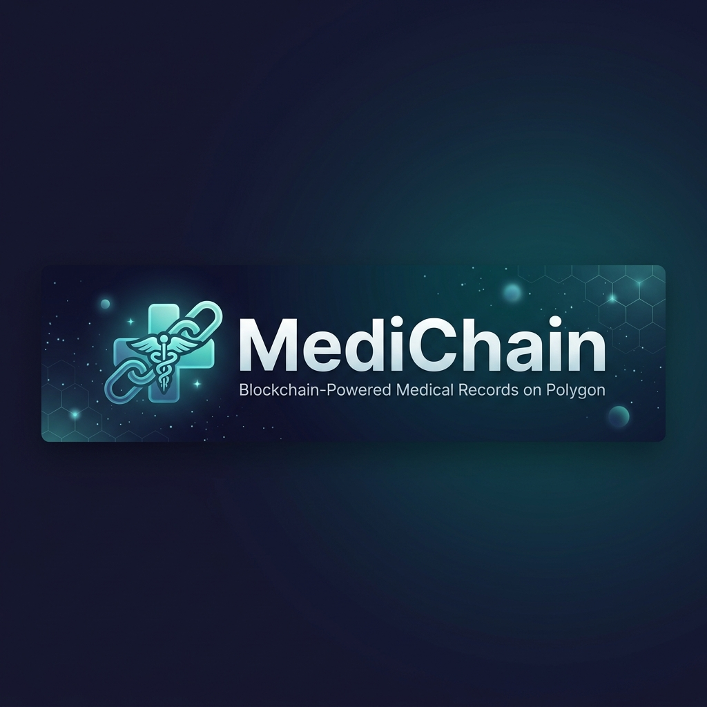
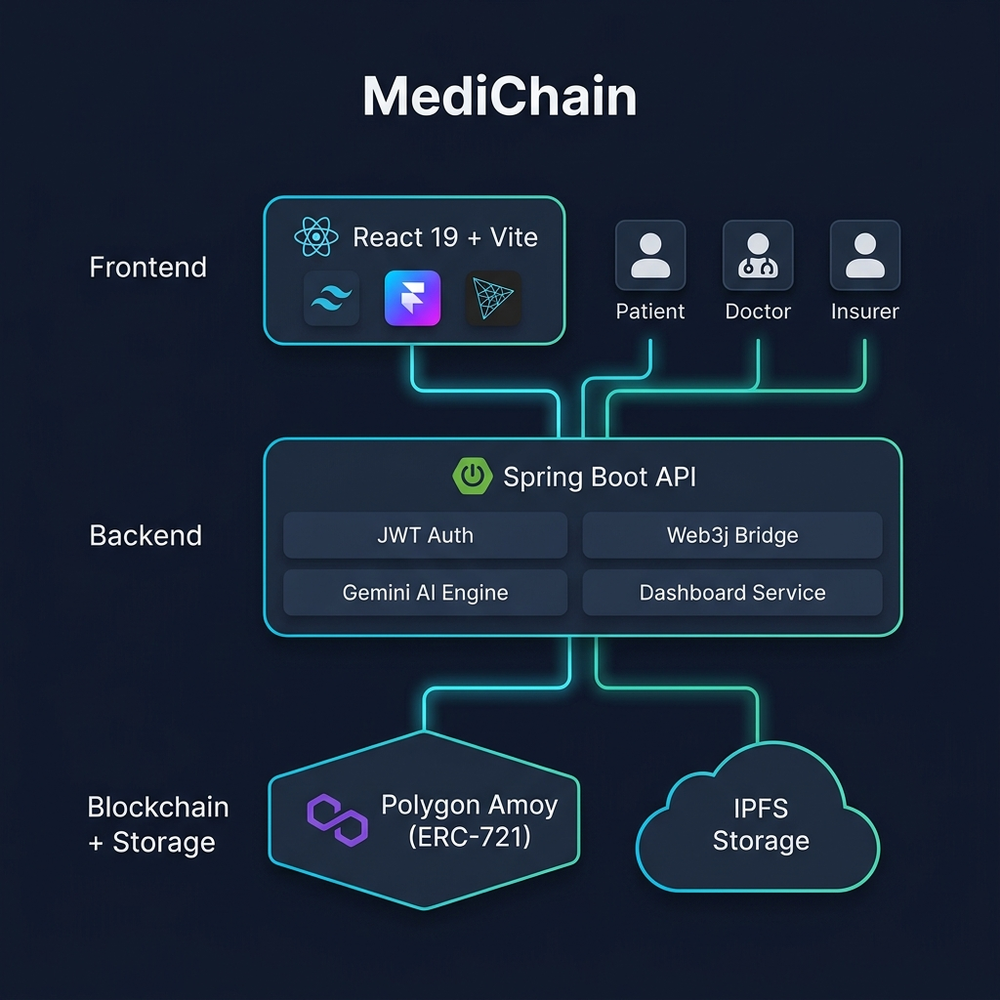

<div align="center">



<br/>

# 🏥 MediChain

### Decentralized Medical Records on Polygon — ERC-721 NFTs, AI-Powered Fraud Detection & Zero-Password Authentication

<br/>

[](https://polygon.technology/)
[](https://react.dev/)
[](https://spring.io/projects/spring-boot)
[](https://ai.google.dev/)
[](LICENSE)

<br/>

[🌐 Live Demo](https://medi-chain-bice.vercel.app) · [🐛 Report Bug](../../issues) · [✨ Request Feature](../../issues)

<br/>

---

**MediChain** transforms healthcare data management by minting every medical record as an **ERC-721 NFT** on the Polygon blockchain. Patients own their data as sovereign digital assets. Doctors get time-bound, granular access. Insurers verify claims through a **3-layer AI Trust Score** — all without ever seeing raw patient data.

---

</div>

<br/>

## 📑 Table of Contents

- [The Problem](#-the-problem)
- [Our Solution](#-our-solution)
- [Key Features](#-key-features)
- [System Architecture](#-system-architecture)
- [Tech Stack](#-tech-stack)
- [Trust Score Engine](#-trust-score-engine--the-3-layer-verification-pipeline)
- [User Flows](#-user-flows)
- [API Reference](#-api-reference)
- [Project Structure](#-project-structure)
- [Getting Started](#-getting-started)
- [Environment Variables](#-environment-variables)
- [Roadmap](#-roadmap)
- [Team](#-team)
- [Acknowledgements](#-acknowledgements)
- [License](#-license)

<br/>

---

## 🚨 The Problem

India's healthcare system manages **over 1.4 billion** patient records across fragmented systems. The consequences are severe:

| Problem | Impact |
|---|---|
| 📂 **Fragmented Records** | Patient data scattered across hospitals with no interoperability |
| 🔓 **Data Breaches** | Healthcare is the #1 target for cyberattacks — 93% of orgs experienced a breach (2023) |
| 🚫 **No Patient Ownership** | Patients cannot access, control, or transfer their own records |
| 💸 **Insurance Fraud** | ₹8,000+ Crore lost annually to fraudulent medical claims in India |
| ⏳ **Delayed Treatments** | Missing records delay emergency care decisions by critical minutes |

<br/>

---

## 💡 Our Solution

MediChain addresses every one of these problems through a **single, unified protocol**:

> 🔗 **Every medical record is an NFT.** The patient's wallet is the vault. The blockchain is the truth.

- **🛡️ Sovereign Ownership** — Records are minted as ERC-721 tokens directly to the patient's wallet. You own your health data like you own your crypto.
- **🔐 Granular Access Control** — Patients grant time-bound, record-level access to doctors and insurers via smart contracts. Access auto-expires. No intermediaries.
- **🤖 AI-Powered Claim Verification** — A 3-layer Trust Score pipeline (On-Chain + Rule Engine + Gemini LLM) detects insurance fraud without exposing raw data.
- **🔑 Zero-Password Auth** — Login with your wallet. Sign a message. Get a JWT. No passwords, no emails, no data to leak.

<br/>

---

## ✨ Key Features

<table>
<tr>
<td width="50%">

### 🧑‍⚕️ For Patients
- **Digital Vault** — All medical records as NFTs in one place
- **QR Check-In** — Scan a QR code to check into a doctor's clinic
- **Granular Permissions** — Grant/revoke access per record with time expiry
- **Episode Timeline** — Records grouped by Episode of Care
- **Real-time Notifications** — Toast alerts for blockchain confirmations

</td>
<td width="50%">

### 🩺 For Doctors
- **Waiting Room** — Real-time queue of checked-in patients
- **Record Minting** — Upload documents → mint to patient's wallet on-chain
- **Record Amendment** — Supersede old records with versioned updates (linked list)
- **Episode Management** — Create and manage Episodes of Care
- **Access Verification** — On-chain + SQL dual-layer access checks

</td>
</tr>
<tr>
<td width="50%">

### 🏦 For Insurers
- **Triple-Check Verification** — On-chain integrity + provider authentication + version check
- **Episode Analysis** — Verify entire treatment episodes in one request
- **AI Fraud Detection** — Gemini-powered anomaly detection with risk scoring
- **Audit Trail** — Full record amendment history via linked-list traversal
- **Trust Score Dashboard** — Visual breakdown of confidence metrics

</td>
<td width="50%">

### ⛓️ Blockchain
- **ERC-721 NFTs** — Each record is a unique, ownable token on Polygon
- **Smart Contract ACL** — `grantGranularAccess()`, `revokeAccess()`, `hasAccess()`
- **On-Chain Integrity** — CID comparison between chain and database
- **Gas-Optimized** — Deployed on Polygon Amoy for sub-cent transactions
- **Immutable Audit** — Every mint and access event is permanently recorded

</td>
</tr>
</table>

<br/>

---

## 🏗️ System Architecture

<div align="center">



</div>

<br/>

```
┌─────────────────────────────────────────────────────────────────┐
│                    🌐  FRONTEND  (React 19 + Vite)              │
│  ┌──────────┐  ┌──────────────┐  ┌──────────────┐              │
│  │ Patient   │  │   Doctor     │  │   Insurer    │              │
│  │ Dashboard │  │  Dashboard   │  │  Dashboard   │              │
│  └─────┬─────┘  └──────┬───────┘  └──────┬───────┘              │
│        │               │                 │                      │
│        └───────────────┼─────────────────┘                      │
│                        │  Thirdweb SDK + JWT                    │
├────────────────────────┼────────────────────────────────────────┤
│                   ⚙️  BACKEND  (Spring Boot 3)                   │
│  ┌─────────────┐ ┌────┴─────┐ ┌──────────────┐ ┌────────────┐  │
│  │  Auth        │ │Dashboard │ │  Blockchain   │ │ AI Engine  │  │
│  │  Controller  │ │Controller│ │  Service      │ │ (Gemini)   │  │
│  │  (JWT+Nonce) │ │(REST API)│ │  (Web3j)      │ │            │  │
│  └──────────────┘ └──────────┘ └───────┬───────┘ └─────┬──────┘  │
│                                        │               │        │
├────────────────────────────────────────┼───────────────┼────────┤
│              🗄️  DATA LAYER                             │        │
│  ┌──────────────┐  ┌───────────┐  ┌────┴────┐   ┌──────┴─────┐ │
│  │  PostgreSQL  │  │   IPFS    │  │ Polygon │   │ Google     │ │
│  │  (Records,   │  │  (Pinata) │  │  Amoy   │   │ Gemini API │ │
│  │   Grants,    │  │           │  │ ERC-721 │   │ (LLM)      │ │
│  │   Episodes)  │  │           │  │         │   │            │ │
│  └──────────────┘  └───────────┘  └─────────┘   └────────────┘ │
└─────────────────────────────────────────────────────────────────┘
```

<br/>

---

## 🛠️ Tech Stack

### Frontend
| Technology | Purpose |
|---|---|
| **React 19** | UI Framework with latest concurrent features |
| **Vite 8** | Lightning-fast HMR and build tooling |
| **TailwindCSS 3** | Utility-first styling with custom design tokens |
| **Framer Motion 12** | Fluid animations, page transitions, gesture support |
| **Three.js + R3F** | 3D elements on the landing page |
| **GSAP 3** | High-performance scroll and timeline animations |
| **Thirdweb SDK** | Wallet connection, message signing, chain switching |
| **Radix UI** | Accessible, unstyled headless UI primitives |
| **Recharts** | Dashboard data visualizations and charts |
| **Shadcn/ui** | Pre-built component library on top of Radix |
| **Lucide + Tabler Icons** | Comprehensive icon systems |

### Backend
| Technology | Purpose |
|---|---|
| **Spring Boot 3** | Production-grade REST API framework |
| **Spring Security** | JWT-based authentication with role-based access |
| **Web3j** | Java ↔ Ethereum/Polygon smart contract bridge |
| **PostgreSQL** | Relational data store for records, grants, episodes |
| **Google Gemini API** | LLM-powered medical fraud analysis |
| **Lombok** | Boilerplate reduction for entities and DTOs |
| **JPA / Hibernate** | ORM with auto-schema management |

### Blockchain & Storage
| Technology | Purpose |
|---|---|
| **Polygon Amoy** | EVM-compatible L2 testnet (chainId: 80002) |
| **Solidity (ERC-721)** | `MedRecordNFT.sol` smart contract |
| **IPFS (Pinata)** | Decentralized, content-addressed document storage |

### DevOps & Deployment
| Technology | Purpose |
|---|---|
| **Vercel** | Frontend hosting with edge network CDN |
| **Render** | Backend hosting with auto-deploy from GitHub |
| **GitHub Actions** | CI/CD pipeline |

<br/>

---

## 🧠 Trust Score Engine — The 3-Layer Verification Pipeline

MediChain's signature feature is a **composite Trust Score** that gives insurers a single, quantified risk metric for any medical claim — without ever exposing raw patient data.

```
┌─────────────────────────────────────────────────────────────┐
│                  TRUST SCORE (0 – 100)                      │
├──────────────────┬──────────────────┬───────────────────────┤
│  🔗 Layer 1       │  📏 Layer 2       │  🤖 Layer 3           │
│  Triple-Check     │  Rule Engine      │  Gemini LLM          │
│  (0-40 pts)       │  (0-40 pts)       │  (0-20 pts)          │
├──────────────────┼──────────────────┼───────────────────────┤
│ • Provider Auth  │ • Date Sequence  │ • Anomaly Detection  │
│   (15 pts)       │   Validation     │ • Pattern Analysis   │
│ • CID Integrity  │ • Referral Chain │ • Risk Assessment    │
│   (15 pts)       │ • Bill ↔ Proc    │ • Confidence Score   │
│ • Latest Version │   Matching       │ • Recommendation     │
│   (10 pts)       │ • Duplicate      │   (APPROVE/REVIEW/   │
│                  │   Detection      │    REJECT)           │
│                  │ • Multi-Hospital │                       │
│                  │   Same-Day Check │                       │
└──────────────────┴──────────────────┴───────────────────────┘
```

### Layer 1: Triple-Check (On-Chain Verification)
Reads data directly from the Polygon smart contract and compares against the database:

| Check | Points | What It Validates |
|---|---|---|
| **Provider Verified** | 15 | Issuing doctor is a registered `DOCTOR` in the system |
| **Integrity Valid** | 15 | IPFS CID on-chain matches the database record |
| **Latest Version** | 10 | Record has not been superseded by a newer amendment |

### Layer 2: Rule Engine (Deterministic Logic)
Five hardcoded medical fraud detection rules:

| Rule | Deduction | Trigger |
|---|---|---|
| `Impossible Date Sequence` | -30 | Lab/Surgery report dated before Diagnosis |
| `Bill Without Procedure` | -25 | Final Bill exists but no Surgery/Procedure report |
| `Same-Day Multi-Hospital` | -35 | 3+ different doctors on the same calendar day |
| `Missing Referral Link`  | -20 | Multiple providers but no Referral document |
| `Duplicate Record Type`  | -15 | Multiple active records of the same type |

### Layer 3: Gemini LLM (AI Analysis)
The full episode metadata + Rule Engine findings are sent to Google Gemini for a final AI judgment:

```json
{
  "additional_anomalies": ["Flagged patterns not caught by rules"],
  "risk_level": "LOW | MEDIUM | HIGH",
  "confidence": 85,
  "reasoning": "Plain English explanation of findings",
  "recommendation": "APPROVE | REVIEW | REJECT"
}
```

> **Final Score** = Triple-Check (max 40) + Rule Engine (max 40) + LLM Bonus (max 20)
> 
> | Score Range | Risk Level |
> |---|---|
> | 90 – 100 | 🟢 **LOW** — Safe to process |
> | 65 – 89 | 🟡 **MEDIUM** — Manual review recommended |
> | 0 – 64 | 🔴 **HIGH** — Potential fraud detected |

<br/>

---

## 🔄 User Flows

### 🧑 Patient Flow
```
1. Open MediChain → Click "Connect Wallet" (MetaMask / WalletConnect)
2. Sign a nonce message → Backend verifies → JWT issued (no password!)
3. First-time? Register with name + role → Stored on-chain profile
4. Dashboard loads: NFT records, episodes, active access grants
5. Scan doctor's QR code → Check into clinic waiting room
6. Doctor requests access → Patient grants per-record, time-bound access
7. Access auto-expires after set duration (default: 24h)
8. Revoke any grant at any time → On-chain + SQL soft-delete
```

### 🩺 Doctor Flow
```
1. Login with wallet → Backend verifies DOCTOR role via JWT
2. Waiting Room shows all checked-in patients in real-time
3. Select patient → View only records with active access grants
4. Upload new document → IPFS → Mint as ERC-721 to patient's wallet
5. Need to update? → Amend record → Old version marked superseded
6. Create Episodes of Care → Group related records logically
7. Complete appointment → Patient removed from waiting room
```

### 🏦 Insurer Flow
```
1. Login with wallet → Backend verifies INSURER role
2. Enter patient address + record/episode ID
3. Single Record: Triple-Check runs → Trust Score returned
4. Episode Verify: All records verified → Composite Trust Score
5. AI Analysis: Gemini reviews episode for anomalies
6. Trust Score dashboard: Visual breakdown of all three layers
7. Recommendation: APPROVE / REVIEW / REJECT
8. Full audit trail: Linked-list traversal of all record versions
```

<br/>

---

## 📡 API Reference

> Base URL: `https://your-backend.onrender.com/api/v1`

### 🔐 Authentication — No passwords, just cryptography

| Method | Endpoint | Description | Auth |
|---|---|---|---|
| `POST` | `/auth/nonce` | Get a unique message to sign | ❌ |
| `POST` | `/auth/verify` | Submit signature → receive JWT | ❌ |
| `GET`  | `/auth/health` | Backend health check | ❌ |

### 🧑 Patient Endpoints

| Method | Endpoint | Description | Auth |
|---|---|---|---|
| `GET`  | `/dashboard/patient/vault` | Fetch all NFT records | `PATIENT` |
| `GET`  | `/dashboard/patient/episodes` | Fetch episodes of care | `PATIENT` |
| `POST` | `/dashboard/patient/check-in` | Check into doctor's clinic | `PATIENT` |
| `POST` | `/dashboard/patient/leave-clinic` | Leave waiting room | `PATIENT` |
| `GET`  | `/dashboard/patient/check-in-status` | Current check-in status | `PATIENT` |
| `GET`  | `/dashboard/patient/active-grants` | All active access grants | `PATIENT` |
| `POST` | `/dashboard/patient/grant-access` | Grant time-bound access | `PATIENT` |
| `POST` | `/dashboard/patient/revoke-access` | Revoke record access | `PATIENT` |

### 🩺 Doctor Endpoints

| Method | Endpoint | Description | Auth |
|---|---|---|---|
| `GET`  | `/dashboard/doctor/waiting-room` | View checked-in patients | `DOCTOR` |
| `GET`  | `/dashboard/doctor/accessible-records/{addr}` | Records with active access | `DOCTOR` |
| `GET`  | `/dashboard/doctor/episodes/{addr}` | Patient's episodes | `DOCTOR` |
| `POST` | `/dashboard/doctor/mint-record` | Mint new NFT record | `DOCTOR` |
| `POST` | `/dashboard/doctor/amend-record` | Amend existing record | `DOCTOR` |
| `POST` | `/dashboard/doctor/create-episode` | Create Episode of Care | `DOCTOR` |
| `POST` | `/dashboard/doctor/complete-appointment` | Complete appointment | `DOCTOR` |

### 🏦 Insurer Endpoints

| Method | Endpoint | Description | Auth |
|---|---|---|---|
| `GET` | `/dashboard/insurer/verify-record` | Triple-Check a single record | `INSURER` |
| `GET` | `/dashboard/insurer/verify-episode` | Verify entire episode + AI analysis | `INSURER` |

### 👤 User Endpoints

| Method | Endpoint | Description | Auth |
|---|---|---|---|
| `POST` | `/users/register` | Register new user with role | ✅ |
| `GET`  | `/users/profile/{wallet}` | Get user profile | ✅ |

<br/>

---

## 📁 Project Structure

```
medichain/
│
├── 📂 Frontend/                          # React + Vite SPA
│   ├── src/
│   │   ├── App.jsx                       # Root router & providers
│   │   ├── main.jsx                      # Vite entry point
│   │   ├── index.css                     # Global styles & design tokens
│   │   │
│   │   ├── 📂 components/
│   │   │   ├── Navbar.jsx                # Main navigation with wallet connect
│   │   │   ├── HeroSection.jsx           # 3D landing hero with Three.js
│   │   │   ├── MissionSection.jsx        # Mission statement + bento grid
│   │   │   ├── ChallengesSection.jsx     # Problem showcase
│   │   │   ├── CoreCapabilitiesBentoGrid.jsx  # Feature highlights
│   │   │   ├── ArchitectureSection.jsx   # Tech stack visualization
│   │   │   ├── HowItWorksSection.jsx     # Step-by-step user guide
│   │   │   ├── TestimonialsSection.jsx   # Social proof
│   │   │   ├── CtaBannerSection.jsx      # Call-to-action
│   │   │   ├── RegisterModal.jsx         # Role registration dialog
│   │   │   ├── ProtectedRoute.jsx        # Role-based route guard
│   │   │   │
│   │   │   ├── 📂 dashboard/
│   │   │   │   ├── PatientDashboard.jsx  # Patient vault, grants, QR check-in
│   │   │   │   ├── DoctorDashboard.jsx   # Waiting room, minting, episodes
│   │   │   │   ├── InsurerDashboard.jsx  # Verification, trust scores, AI
│   │   │   │   ├── DashboardLayout.jsx   # Shared sidebar layout
│   │   │   │   └── BentoStats.jsx        # Statistics grid component
│   │   │   │
│   │   │   ├── 📂 common/               # Shared utility components
│   │   │   │   ├── QRDisplay.jsx         # QR code generator
│   │   │   │   ├── QRScanner.jsx         # Camera-based QR scanner
│   │   │   │   ├── WalletAddress.jsx     # Truncated address display
│   │   │   │   ├── TrustScoreBadge.jsx   # Visual trust score meter
│   │   │   │   ├── StatusBadge.jsx       # Color-coded status indicators
│   │   │   │   ├── LoadingSpinner.jsx    # Animated loading state
│   │   │   │   ├── EmptyState.jsx        # Zero-data placeholder
│   │   │   │   ├── ToastNotification.jsx # Context-based toast system
│   │   │   │   └── AppLayout.jsx         # Responsive app shell
│   │   │   │
│   │   │   ├── 📂 animated/             # Motion components
│   │   │   │   ├── FluidTabs.jsx         # Animated tab switcher
│   │   │   │   ├── ShimmerButton.jsx     # Glowing CTA button
│   │   │   │   └── WigglingCards.jsx     # Interactive card animations
│   │   │   │
│   │   │   └── 📂 ui/                   # Shadcn/Radix primitives
│   │   │       ├── dialog.jsx, tabs.jsx, select.jsx, tooltip.jsx ...
│   │   │
│   │   ├── 📂 context/
│   │   │   ├── AuthContext.jsx           # Wallet auth + JWT state management
│   │   │   └── ThemeContext.jsx          # Dark/light mode toggle
│   │   │
│   │   ├── 📂 services/
│   │   │   └── api.js                    # Centralized API client (349 LOC)
│   │   │
│   │   └── 📂 hooks/
│   │       └── use-mobile.jsx            # Responsive breakpoint hook
│   │
│   ├── package.json
│   ├── tailwind.config.js
│   └── vite.config.js
│
├── 📂 backend/                           # Spring Boot REST API
│   └── src/main/java/org/medichain/backend/
│       ├── BackendApplication.java       # Spring Boot entry point
│       │
│       ├── 📂 controller/
│       │   ├── AuthController.java       # Nonce + signature verification
│       │   ├── DashboardController.java  # Patient/Doctor/Insurer REST APIs
│       │   ├── BlockchainController.java # Direct blockchain interactions
│       │   ├── EpisodeController.java    # Episode CRUD operations
│       │   ├── InsurerController.java    # Insurer-specific endpoints
│       │   └── UserController.java       # User profile management
│       │
│       ├── 📂 service/
│       │   ├── AuthService.java          # Nonce generation + ECDSA verification
│       │   ├── BlockchainService.java    # Web3j smart contract bridge (428 LOC)
│       │   ├── DashboardService.java     # Business logic aggregation
│       │   ├── EpisodeService.java       # Episode management
│       │   └── 📂 ai/
│       │       ├── GeminiAnalysisService.java    # Gemini API integration
│       │       ├── EpisodeRuleService.java       # 5-rule fraud detection engine
│       │       ├── EpisodeMetadataBuilder.java   # Episode → JSON serializer
│       │       └── TrustScoreAggregator.java     # 3-layer score compositor
│       │
│       ├── 📂 entity/
│       │   ├── MedicalRecord.java        # NFT record ↔ DB mapping
│       │   ├── AccessGrant.java          # Time-bound access permissions
│       │   ├── Episode.java              # Episode of Care grouping
│       │   ├── ClinicCheckIn.java        # Waiting room check-ins
│       │   └── User.java                 # Wallet-based user profiles
│       │
│       ├── 📂 security/
│       │   ├── JwtAuthFilter.java        # Request-level JWT validation
│       │   └── JwtAuthEntryPoint.java    # 401 Unauthorized handler
│       │
│       ├── 📂 blockchain/
│       │   └── MedRecordNFT.java         # Auto-generated Web3j contract wrapper
│       │
│       ├── 📂 config/
│       │   └── SecurityConfig.java       # CORS, CSRF, session management
│       │
│       └── 📂 dto/
│           ├── ApiResponse.java          # Standardized response wrapper
│           └── ...Request DTOs
│
├── 📂 docs/
│   └── assets/                           # Images and diagrams
│
└── README.md
```

<br/>

---

## 🚀 Getting Started

### Prerequisites

| Tool | Minimum Version |
|---|---|
| **Node.js** | 18+ |
| **Java JDK** | 17+ |
| **Maven** | 3.8+ |
| **PostgreSQL** | 14+ |
| **MetaMask** | Latest (browser extension) |
| **Git** | 2.30+ |

### 1. Clone the Repository

```bash
git clone https://github.com/CodeVoyager3/MediChain.git
cd MediChain
```

### 2. Set Up the Database

```sql
-- Create the database
CREATE DATABASE medichain;

-- The schema auto-generates via JPA (spring.jpa.hibernate.ddl-auto=update)
```

### 3. Start the Backend

```bash
cd backend

# Set environment variables (or use application.properties defaults)
export DB_HOST=localhost
export DB_PORT=5432
export DB_NAME=medichain
export DB_USER=postgres
export DB_PASSWORD=your_password
export JWT_SECRET=your_jwt_secret_min_32_characters_long
export BLOCKCHAIN_PRIVATE_KEY=your_polygon_amoy_private_key
export GEMINI_API_KEY=your_gemini_api_key

# Build and run
./mvnw spring-boot:run
```

Backend starts at `http://localhost:8080`

### 4. Start the Frontend

```bash
cd Frontend

# Install dependencies
npm install

# Set environment
echo "VITE_API_BASE_URL=http://localhost:8080" > .env.local

# Start dev server
npm run dev
```

Frontend starts at `http://localhost:5173`

### 5. Configure MetaMask

1. Open MetaMask → Add Network
2. **Network Name:** Polygon Amoy Testnet
3. **RPC URL:** `https://rpc-amoy.polygon.technology`
4. **Chain ID:** `80002`
5. **Currency Symbol:** `MATIC`
6. **Explorer:** `https://amoy.polygonscan.com`
7. Get test MATIC from the [Polygon Faucet](https://faucet.polygon.technology/)

<br/>

---

## 🔐 Environment Variables

### Backend (`application.properties`)

| Variable | Description | Default |
|---|---|---|
| `DB_HOST` | PostgreSQL host | `localhost` |
| `DB_PORT` | PostgreSQL port | `5432` |
| `DB_NAME` | Database name | `medichain` |
| `DB_USER` | Database username | `postgres` |
| `DB_PASSWORD` | Database password | `pass123` |
| `JWT_SECRET` | JWT signing secret (min 32 chars) | — |
| `BLOCKCHAIN_PRIVATE_KEY` | Polygon wallet private key for contract calls | — |
| `GEMINI_API_KEY` | Google Gemini API key for AI analysis | — |
| `GEMINI_MODEL` | Gemini model identifier | `gemma-3-27b-it` |

### Frontend (`.env.local`)

| Variable | Description |
|---|---|
| `VITE_API_BASE_URL` | Backend API base URL |

<br/>

---

## 🗺️ Roadmap

- [x] ERC-721 medical record NFTs on Polygon Amoy
- [x] Smart contract access registry with granular record-level control
- [x] Wallet-based authentication (zero-password, ECDSA signatures)
- [x] IPFS encrypted document storage via Pinata
- [x] Role-specific dashboards (Patient + Doctor + Insurer)
- [x] QR-based clinic check-in / waiting room system
- [x] Episodes of Care — logical record grouping
- [x] Record versioning with supersede/amend linked-list chain
- [x] 3-Layer Trust Score (Triple-Check + Rule Engine + Gemini LLM)
- [x] AI-powered insurance fraud detection
- [x] Full audit trail with linked-list record traversal
- [x] Production deployment (Vercel + Render)
- [ ] 📱 Mobile app (React Native + WalletConnect)
- [ ] 🆔 ABHA ID integration (Ayushman Bharat Health Account)
- [ ] 🌐 Multi-chain support (Ethereum mainnet, Arbitrum, Base)
- [ ] 🔒 Zero-Knowledge Proofs for privacy-preserving queries
- [ ] 🏥 Hospital ERP integration (HL7 FHIR standard)
- [ ] 🚨 Emergency access QR with geofencing
- [ ] 📊 Anonymized health analytics dashboard

<br/>

---

## 👥 Team

<div align="center">

Built with ❤️ for **Code Veda 2.0** at ADGIPS — *Geek Room Hackathon*

</div>

<br/>

<table align="center">
<tr>
<td align="center" width="25%">
<a href="https://github.com/CodeVoyager3">
<br />
<sub><b>Amritesh Kumar Rai</b></sub>
</a><br />
<sub>Full-Stack · Blockchain · Smart Contracts</sub><br/>
<a href="https://github.com/CodeVoyager3"></a>
</td>
<td align="center" width="25%">
<a href="https://github.com/mayank1008-tech">
<br />
<sub><b>Mayank Jain</b></sub>
</a><br />
<sub>Backend · Spring Boot · System Design</sub><br/>
<a href="https://github.com/mayank1008-tech"></a>
</td>
<td align="center" width="25%">
<a href="https://github.com/Nishchaysaluja10">
<br />
<sub><b>Nishchay Saluja</b></sub>
</a><br />
<sub>Frontend · UI/UX · React</sub><br/>
<a href="https://github.com/Nishchaysaluja10"></a>
</td>
<td align="center" width="25%">
<a href="https://github.com/divyansh-xyz">
<br />
<sub><b>Divyansh</b></sub>
</a><br />
<sub>Frontend · Web3 Integration</sub><br/>
<a href="https://github.com/divyansh-xyz"></a>
</td>
</tr>
</table>

<br/>

---

## 🙏 Acknowledgements

- [**OpenZeppelin**](https://openzeppelin.com) — Battle-tested smart contract libraries
- [**Polygon**](https://polygon.technology) — Low-cost, EVM-compatible L2 blockchain
- [**Web3j**](https://docs.web3j.io) — Java ↔ Ethereum integration library
- [**Thirdweb**](https://thirdweb.com) — Web3 wallet SDK and chain management
- [**Google Gemini**](https://ai.google.dev) — Large Language Model for fraud analysis
- [**IPFS / Pinata**](https://pinata.cloud) — Decentralized content-addressed storage
- [**Vercel**](https://vercel.com) — Frontend hosting platform
- [**Render**](https://render.com) — Backend hosting and deployment
- [**Radix UI**](https://radix-ui.com) — Accessible headless UI primitives
- [**Shadcn/ui**](https://ui.shadcn.com) — Beautiful, customizable component library
- **Geek Room — ADGIPS** for organizing **Code Veda 2.0**

<br/>

---

## 📄 License

```
MIT License

Copyright (c) 2025 MediChain Team

Permission is hereby granted, free of charge, to any person obtaining a copy
of this software and associated documentation files (the "Software"), to deal
in the Software without restriction, including without limitation the rights
to use, copy, modify, merge, publish, distribute, sublicense, and/or sell
copies of the Software, and to permit persons to whom the Software is
furnished to do so, subject to the following conditions:

The above copyright notice and this permission notice shall be included in all
copies or substantial portions of the Software.

THE SOFTWARE IS PROVIDED "AS IS", WITHOUT WARRANTY OF ANY KIND, EXPRESS OR
IMPLIED, INCLUDING BUT NOT LIMITED TO THE WARRANTIES OF MERCHANTABILITY,
FITNESS FOR A PARTICULAR PURPOSE AND NONINFRINGEMENT. IN NO EVENT SHALL THE
AUTHORS OR COPYRIGHT HOLDERS BE LIABLE FOR ANY CLAIM, DAMAGES OR OTHER
LIABILITY, WHETHER IN AN ACTION OF CONTRACT, TORT OR OTHERWISE, ARISING FROM,
OUT OF OR IN CONNECTION WITH THE SOFTWARE OR THE USE OR OTHER DEALINGS IN THE
SOFTWARE.
```

<br/>

---

<div align="center">

**Made with ❤️ for a healthier, more transparent India**

<br/>

[⭐ Star this repo](../../) · [🐛 Report Bug](../../issues) · [✨ Request Feature](../../issues)

<br/>


<br/>

<sub>Built at Code Veda 2.0 · ADGIPS · Geek Room Hackathon</sub>

</div>
